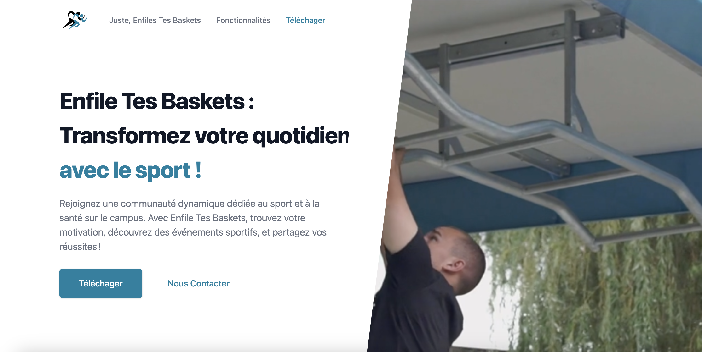

# Enfiles Tes Baskets : landing page

### 🎆 Aperçu 

🔴 [prod] https://enfile-tes-baskets.vercel.app/



### 📄 Description

Ce projet constitue le landing page de l'application mobile `Enfile Tes Baskets`. C'est un site web qui présente l'application dans sa globalité et propose le téléchargement de son `apk`, si ce dernier est disponible.

L'`apk` peut être stocké n'importe où (comme `Gooogle Drive`) tant qu'il y a une `url` qui permet d'y accéder et de le télécharger.

### 🧰 Technos

- 📱  Responsive design
- 🔥 [Next.js](https://nextjs.org) qui est un framework `React`, donc ça reste du React

- 🎨 [Tailwind CSS](https://tailwindcss.com)

- 💅 PostCSS pour le processing de Tailwind CSS

- 🎉 [TypeScript](https://www.typescriptlang.org)

- 🗂 VSCode configuration: Debug, Settings, Tasks et les extensions pour PostCSS, ESLint, Prettier, TypeScript

- 🤖 SEO metadata, JSON-LD et Open Graph Tags pour le SEO

- 🖱️ Déploiement en un seul clic avec Vercel ou Netlify (ou déploiement manuel pour les autres services d'herbergement)

### ⚙️ Run

#### 0. Variable d'environnement

Ne pas oublier de mettre à jour la variable d'environnement `NEXT_PUBLIC_APK_DOWNLOAD_URL` dans le fichier `.env` pour le lien l'apk (si disponible) qui aura la possibilité d'être téléchargé.

#### 1. Lancer le projet
- Installer les dépendances

```
npm i
```

- Ensuite, vous pouvez lancer localement l'app en mode developpement

```
npm run dev
```

- Ouvrez `http://localhost:3000` avec votre navigateur pour voir la landing page.

#### 2. Mise à jour du contenu

 1. **Contenu**: changez la configuration dans le fichier ```src/config/index.json``` pour modifiez le contenu de la landing page.
 2. **Images**:  ajoutez n'importe quel image/icon etc... dans le dossier ```public/assets/images``` et mettez à jour les références des sources dans le fichier ```src/config/index.json```.
 3. **Thème**:  pour modifier de thème, il faut mettre à jour le fichier ```tailwind.config.js``` pour avoir un thème qui correspond aux couleurs souhaitées. [Tutoriel](https://tailwindcss.com/docs/configuration).

